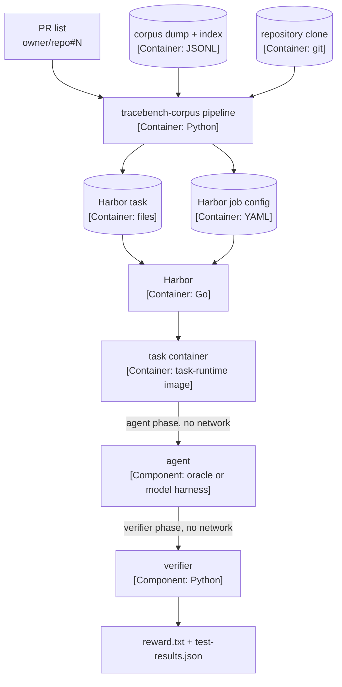

# Mermaid notation for TraceBench

TraceBench documents render on GitHub, and GitHub renders Mermaid. Draw TraceBench C4 diagrams as
Mermaid `flowchart` blocks. Commit messages, terminal output, and agent transcripts keep the ASCII
notation in `ascii-notation.md`.

## Rules

1. **One diagram per block.** Use a fenced block with the info string `mermaid`. Write a caption
   line above the block in the form `<Type> diagram: <scope>.` plus one sentence on the flow.
   Mermaid has no key section; the caption carries the legend, or the legend is omitted.
2. **Narrow and vertical.** Use `flowchart TB` and keep the chain top-to-bottom. Use no more than
   about twelve nodes in one diagram. Do not spread a wide left-to-right graph.
3. **One abstraction level per diagram.** A container diagram shows containers, plus the people
   and systems that touch them. Do not mix a component into a container diagram. A dynamic
   diagram may show the numbered steps of one story.
4. **C4 type tags in the node labels.** Use `name [Type: technology]`, for example
   `loader["tracebench-corpus pipeline [Container: Python]"]`. The closed set of type tags is
   in `ascii-notation.md`. A person uses a rounded shape: `eng(["benchmark engineer"])`.
5. **Data stores use the cylinder shape**: `dump[("corpus dump [Container: JSONL]")]`.
6. **One arrow, one direction, one label.** Put the intent and the technology in the edge label:
   `sandbox -- "agent phase, no network" --> agent`. Do not use two-headed arrows.
7. **Number the steps on a dynamic diagram.** Start each edge label with the step number.
8. **Short labels.** One line per node where possible. Use ` ` for the type tag. Keep the
   one-sentence element description in the model table or the caption, not in the node.
9. **Match the code.** Re-derive the elements and the relationships from the source before you
   redraw. A diagram that disagrees with the code is wrong.

## Lint

`scripts/c4-lint.py` checks ASCII `c4` blocks only. It does not read `mermaid` blocks. Check a
Mermaid diagram by rendering it (the GitHub preview, or `mmdc`) and by reading it against the
rules above.

## Example

Container diagram: one eval run. A PR list becomes tasks and a job config; Harbor runs each task
offline; the verifier writes the reward. The live copy is in the TraceBench `README.md`.

