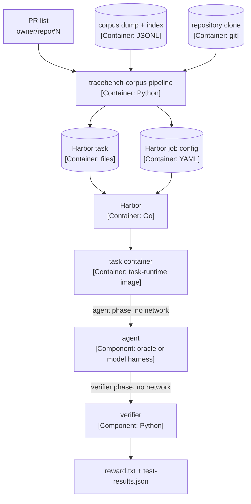

# TraceBench

Agent benchmarks with **network-restricted sandboxes**. Tasks are built on
[Harbor](https://harborframework.com) (`hub.harborframework.com` hosts shared
datasets/tasks/leaderboards; the sandbox that actually enforces isolation is the
provider you run with, e.g. local `docker`).

Goal: agents that can do real engineering work **without** hacking their way out
— no curl-ing solutions, no pip-installing bypasses, no exfiltrating tests.

See [docs/architecture.md](docs/architecture.md) for C4 diagrams and call
sequences of the corpus and task-generation system.

## How isolation works

Each task declares a network policy in `task.toml`:

```toml
[environment]  # baseline at start — public so agent.setup() can install
network_mode = "public"

[agent]        # during agent.run() — locked down
network_mode = "no-network"

[verifier]     # during verify() — locked down
network_mode = "no-network"
```

* `public` / `no-network` / `allowlist` (with `allowed_hosts`) per phase.
* Deps are baked into the image (`environment/Dockerfile`) so run/verify
  phases need zero egress.
* Tests use randomized ids so hardcoded golden files can't pass.

See `tasks/trace-propagation/task.toml` for the reference example.

## Repo layout

```
tasks/<name>/
  instruction.md          # what the agent must do
  task.toml               # metadata + network policy + timeouts
  environment/
    Dockerfile            # sandbox image (deps pre-installed)
    app/                  # repo snapshot the agent works on
  solution/solve.sh       # oracle fix (proves the task is solvable)
  tests/
    test.sh               # offline verifier, writes /logs/verifier/reward.txt
    test_outputs.py       # pytest grading (randomized, behavioral)
```

## Quickstart

Install Harbor:

```bash
uv tool install harbor
```

You also need docker-compose v2 on the PATH. Harbor's podman provider calls `docker compose`.

Our runner is `tracebench-corpus pipeline`: it turns a list of merged pull requests into runnable
Harbor tasks plus one Harbor job config, and `harbor run` executes the job:

```bash
# Before any Harbor run, re-tag the shared images (Harbor's teardown removes the image a task
# references; the :keep aliases hold them):
scripts/ensure-task-images.sh

# Our three-PR generated job (peasant-labs/peasant#344, peasant-labs/peasant#406, peasant-labs/peasant#527): build it, then run the job config.
# The corpus dump and index live under corpus/ (see Corpus sampling).
printf 'peasant-labs/peasant#344\npeasant-labs/peasant#406\npeasant-labs/peasant#527\n' > /tmp/prs.txt
uv sync
uv run tracebench-corpus --corpus corpus/dump pipeline \
  --prs /tmp/prs.txt \
  --repo-dir /path/to/peasant-clone \
  --index corpus/index/merged_prs.json \
  --dest build/mvp \
  --run-id tracebench-mvp
harbor run -c build/mvp/job-config-tracebench-mvp.yaml -e podman -k 1

# Inspect trajectories / verifier logs:
harbor view ./jobs
```

Generated tasks score around 0.998 under the oracle (the residual is the documented calibration
set). To smoke-test a real agent, network is needed ONLY on the host for the model API; the
sandbox itself stays offline during the run:

```bash
harbor run -p build/mvp/tasks/peasant-pr-0344 -a claude-code -m anthropic/claude-haiku-4-5 -e podman
```

For the full proof-of-concept runbook — dependencies, image setup with the `:keep` re-tag step,
the jobs above end to end, and troubleshooting — see
[`docs/proof-of-concept.md`](docs/proof-of-concept.md).

## How a run works

The diagram shows the C4 container view of one eval run. You give a list of pull requests. The
loader writes the tasks and the job config. Harbor runs each task in the shared image. The
verifier writes the reward.



## Runtime flags

The generated task sets these flags and policies. The agent and the verifier stay offline. The
loader flags (`--prs`, `--repo-dir`, `--index`, `--dest`, `--run-id`) are in
[Build a task from the corpus](#build-a-task-from-the-corpus).

| Setting | What it does | Why it is set |
|---|---|---|
| `GOPROXY=off` | Go does not download modules. | The agent and the verifier must stay offline. |
| `GOFLAGS=-mod=readonly -buildvcs=false` | Go reads the module cache only. Go does not stamp VCS data. | The build needs no network. The uploaded repository belongs to another user, so VCS stamping fails. |
| Healthcheck: `GOPROXY=https://proxy.golang.org,direct go mod download` | The healthcheck downloads the modules of the base commit. | The shared image has no module cache for the base commit. The environment phase has network. |
| Healthcheck: `go build ./...` | The healthcheck builds the pre-PR tree. | The tree must build before the agent starts. |
| Healthcheck: `git config --system --add safe.directory /workdir/repo` | Git accepts the uploaded repository. | Harbor keeps the host user ID during the upload. |
| `[environment] network_mode = "public"` | The environment phase can use the network. | The healthcheck needs the Go proxy. |
| `[agent]`, `[verifier] network_mode = "no-network"` | The agent and the verifier cannot use the network. | The agent cannot fetch the fix. |
| `workdir = "/workdir"` | The container starts in `/workdir`. | Harbor uploads the task data to this directory. |
| `docker_image = "tracebench/task-runtime:latest"` | Every task uses the shared image. | The pipeline does not build an image for each task. |

## Harbor flags

| Flag | What it does |
|---|---|
| `-p <task>` | Run one task directory. |
| `-c <file>` | Run every task in a job config file. |
| `-a <agent>` | Select the agent. Use `oracle` for the reference solution. |
| `-e <provider>` | Select the container environment. Use `podman` on this machine. |
| `-k <n>` | Set the number of attempts for each task. Use `1` for a quick run. |
| `-m <provider/model>` | Select the model for a real agent run. |
| `--job-name <name>` | Name the job directory under `jobs/`. |

`harbor view ./jobs` shows the trajectories and the verifier logs.

## Tasks

| Task | What it tests | Difficulty |
| - | - | - |
| `tracebench/trace-propagation` | Fix W3C `traceparent` propagation across two services (trace-id, sampled flag, tracestate) | Medium: 3 files to read, reproduce, fix 1 function |
| `tracebench/peasant-smoke` | Containerized Peasant codebase builds + fast unit tests pass (issue #1) | Smoke: no bug fix, proves image-origin and host cleanliness |

## Corpus sampling

`cmd/tracebench-sample` indexes merged `peasant-labs/peasant` pull requests,
links them to agent sessions recorded in a local Peasant database (head-ref
name matches, same-issue open windows, and commit associations; a session may
link to several pull requests), closes over parent/child/fork session lineage
so bundles carry their full session forest, and samples a time- and
size-stratified train/val/test corpus with the raw transcripts:

```bash
go run ./cmd/tracebench-sample index
go run ./cmd/tracebench-sample sample --train 30 --val 10 --test 9
go run ./cmd/tracebench-sample dump
```

The prerelease archive (`--archive-repo`) is indexed for reference but never
sampled: it is frozen pre-launch history and contributes neither tasks nor
prior context.

Indexes land in `corpus/index/`, the sampled dataset in `corpus/dataset/`, and
`dump/` holds a flat, publishable dump: `metadata.jsonl` records in
`schema.UnifiedMetadata`, `transcripts/` envelopes in
`schema.TranscriptContent` (`session_detail`), plus `pull_requests.jsonl` and
`traces.jsonl` indexes. Sampled pull request records carry the published body
and the issue record named by the head branch. Transcripts pass through the `redact` pipeline at the
standard level, metadata omits machine-specific paths, and `--pin-prs FILE`
reproduces a previous sample. The frozen benchmark set is
`data/tracebench/corpus-set.txt`: newline-delimited PR ids, the sampled corpus
narrowed to the task set (pull requests whose changes exceed 5,000 lines are
excluded). It feeds `--pin-prs` for the sampler and `--prs` for the task
pipeline. `--source village-pull` builds the same dump
from `peasant village pull` directories instead of the local database, with
collective provenance in `village_pulls.jsonl`. `corpus/` is ignored by git.
Sessions whose raw source is OpenCode's monolithic database are exported per
entry from the Peasant full-content capture, and the manifests flag missing or
partial transcripts.

The published corpus lives at
[huggingface.co/datasets/dayvidpham/TraceBench](https://huggingface.co/datasets/dayvidpham/TraceBench);
the viewer's `session_pr_traces` table is the session-to-PR mapping
(`pr`, `session_id`, `method`, `relation`, `split`). Consumers pull it with:

```bash
go run ./cmd/tracebench-sample fetch --dest data/tracebench
```

`fetch` downloads `metadata.jsonl`, the indexes, and every transcript, and
verifies each transcript's SHA3-256 against its metadata `contentHash`
(`--no-verify` to skip, `--revision` to pin a revision).

A Python loader for Harbor task environments and verifiers lives in
[`loaders/`](loaders/README.md): it loads the dump (local or directly from
HuggingFace), joins traces, PRs, metadata, and transcript turns, materializes
self-contained per-PR bundles, assembles task payloads (PR + prior traces up
to the PR's develop boundary + integration points for the pre-PR repo and
merged-state golden tests), records the target harness/model/version/thinking
configuration for a run, and generates Harbor task skeletons from those
payloads. The loader is a uv workspace member; from the repository root run
`uv sync` and `uv run pytest`.

## Build a task from the corpus

The `pipeline` command of the loader turns a list of merged pull requests into
runnable Harbor tasks: one task directory per pull request, plus one Harbor job
config for the run.

Prerequisites:

* A corpus dump: `go run ./cmd/tracebench-sample fetch --dest data/tracebench`,
  or a local `corpus/dump` written by `tracebench-sample dump`.
* A local clone of the target repository (for example `peasant-labs/peasant`)
  that contains each pull request's pre-PR commit and merge commit.
* The merged-PR index, `corpus/index/merged_prs.json` (written by
  `tracebench-sample index`). It supplies each pull request's `merge_commit`.
* `git` on the `PATH` (the loader resolves boundaries, extracts the golden suite, and verifies
  the oracle with the git CLI).

Commands:

```bash
uv sync
uv run tracebench-corpus --corpus data/tracebench pipeline \
  --prs "peasant-labs/peasant#343" \
  --repo-dir /path/to/peasant-clone \
  --index corpus/index/merged_prs.json \
  --dest build/run-1 \
  --run-id tracebench-smoke-1
```

Corpus source (global flags, before the subcommand):

* `--corpus DIR` reads a local dump, for example `corpus/dump`. Without it, the loader reads the
  `TRACEBENCH_CORPUS` environment variable.
* `--repo ID` downloads the dump from HuggingFace instead, for example `dayvidpham/TraceBench`.
  `--corpus` and `--repo` are mutually exclusive. `--revision` pins the revision and
  `--cache-dir` sets the cache directory.

Command flags:

* `--prs` takes a pull request id (`owner/repo#N`) or a file with one id per
  line (blank lines and `#` comments are skipped). Repeat it to add more.
* `--spec FILE` selects a repository adaptation spec (the test and build
  command per repository). Without it, the shipped Go/Peasant default applies.
* `--run-id ID` names the run. Without it, pass `--target-configs SPEC
  --target-config NAME`, and the run gets a generated UUIDv7.
* `--force` rebuilds payload and task directories that already exist.

Outputs under `--dest`:

| Path | Contents |
|---|---|
| `payloads/<slug>-pr-NNNN/` | The task payload: `pr.json`, `prior-traces/`, `repo/`, `tests/`, `test-manifest.json`, `solution/`, `repo-request.json`, `task.json`. |
| `tasks/<slug>-pr-NNNN/` | The Harbor task: `task.toml`, `instruction.md`, `environment/`, `tests/`, `solution/`. |
| `job-config.yaml` | The Harbor job config: `job_name` (the run id), `n_attempts: 3`, the built tasks, and `TRACEBENCH_RUN_ID` in `agents[].env` and `verifier.env`. It is `job-config.json` when PyYAML is not installed. |

`<slug>` is `peasant` for `peasant-labs/peasant` and `peasant-archive` for the
prerelease archive; `NNNN` is the zero-padded pull request number. The command
prints one line per pull request. A task that fails names the failed part (for
example `environment/repo` or `solution/oracle.patch`) and does not stop the
other tasks; the job config lists only the tasks that were built, and the exit
code is 1 when any task failed.

Verify with Harbor:

```bash
# Re-tag the shared images first (Harbor's teardown removes the image a task references):
scripts/ensure-task-images.sh

# The oracle applies solution/oracle.patch, then the verifier runs; generated tasks score
# around 0.998 (the residual is the documented calibration set).
harbor run -p build/run-1/tasks/peasant-pr-0343 -a oracle -e podman

# Run every task of the run under the job config (-k 1 for a fast smoke; the config
# carries n_attempts: 3 for real evals).
harbor run -c build/run-1/job-config.yaml -e podman -k 1
```

Harbor is not installed in every development environment. Where it is not,
these are the documented commands, and the loader tests cover the parts that
run without it.

How the pieces fit:

1. **Corpus dump** — the pull request, its sessions, and the prior traces.
2. **Payload** — `pr.json`, the prior traces up to the pull request's develop
   boundary, and `repo-request.json` (the pre-PR commit `tree_commit` and the
   test patterns).
3. **Secure worktree** — `repo/` is the project's full real history truncated
   at the real `tree_commit` (every ancestor with its real SHA, no remotes,
   nothing at or after the PR), packed read-only from the source clone. Its
   tree hash must equal `git rev-parse <tree_commit>^{tree}` and the merge
   commit must be absent from the object store.
4. **Golden suite** — every test file at `merge_commit` that matches the test
   patterns, plus `test-manifest.json`, the catalog of the test cases.
5. **Oracle** — `solution/oracle.patch` is `git diff <tree_commit>
   <merge_commit>`; the build fails closed unless the patch reproduces
   `merge_commit^{tree}`. `solution/solve.sh` applies it and runs the build
   command.
6. **Skeleton** — the Harbor task directory that references the shared base
   image and uploads `environment/` at start.
7. **Verifier** — `tests/test.sh` removes the pre-PR tests, overlays the golden
   suite, runs the test command, and writes the reward (`passed / accepted
   cases`; build-tag-gated cases are rejected and excluded) to
   `/logs/verifier/reward.txt` and a per-case report to `test-results.json`.
8. **Job config** — one Harbor job per run id.

See [`loaders/README.md`](loaders/README.md) for each step and how to modify it.

## Verification status

* Test logic: buggy code fails 6/7 grading tests, oracle-fixed code passes 7/7.
* `harbor run -p tasks/trace-propagation -a oracle -e docker` → reward `1.0`
  (mechanics verified with policy temporarily relaxed to `public`, see below).

> macOS: Docker Desktop's VM kernel lacks `CONFIG_NFT_FIB_INET`, so Harbor
> correctly **fails closed** (`no-network is not supported`) instead of running
> with weaker isolation. **Use Podman locally** — its VM kernel passes Harbor's
> probe and `no-network` enforces correctly (verified: oracle reward `1.0`,
> raw-socket HTTP probes return 0 bytes):
>
> ```bash
> brew install podman
> podman machine init && podman machine start
> harbor run -p tasks/trace-propagation -a oracle -e podman
> ```
>
> Linux Docker and cloud sandboxes (`daytona`, `e2b`, `modal`, …) also enforce
> strictly. To smoke-test mechanics only with Docker Desktop, use a relaxed
> copy — keep the committed `task.toml` strict:
>
> ```bash
> rm -rf /tmp/tb-public && cp -r tasks/trace-propagation /tmp/tb-public
> sed -i '' 's/network_mode = "no-network"/network_mode = "public"/' /tmp/tb-public/task.toml
> harbor run -p /tmp/tb-public -a oracle -e docker
> ```

## Roadmap

* [ ] Separate verifier sandbox (`[verifier.environment_mode = "separate"]`)
* [ ] `allowlist` variant (e.g. PyPI-only) for tasks that need installs at run time
* [ ] Publish dataset to Harbor Hub (`harbor publish`), hosted jobs + leaderboard
* [ ] More tasks (vendored real-bug SWE-style, multi-step)
