# TraceBench architecture

This page shows how the parts of TraceBench connect. It goes from the high level to the low level:

1. [System context](#system-context): TraceBench, its user, and the systems it talks to.
2. [Containers](#containers): the runtime units and data stores inside TraceBench.
3. [Components](#components): the Go packages, the Python loader modules, and the snapshot module.
4. [Deployment](#deployment): where each container runs.
5. [Dynamic views](#dynamic-views): the main flows, in numbered order.
6. [Call sequences](#call-sequences): the same flows at the level of functions and files.
7. [Package map](#package-map): the role of each Go package, Python module, and task directory.

All diagrams are Mermaid, so GitHub renders them in place. The structural views follow the C4
model vocabulary of [`.claude/skills/c4-model`](../.claude/skills/c4-model/SKILL.md) and
are drawn as Mermaid flowcharts: each box names its element, its C4 type in square brackets,
and a short description, and a dashed outline marks a boundary. Every arrow is one relationship,
read as "source, label (technology), target". The dynamic views and the call sequences are
Mermaid sequence diagrams. Colors follow the C4 convention: dark blue for people, blue for
TraceBench's own elements, and grey for external systems.

The libraries `github.com/peasant-labs/schema` (wire contract), `github.com/peasant-labs/redact`
(redaction engine), `gopkg.in/yaml.v3`, `modernc.org/sqlite`, and `huggingface_hub` are not
containers. They show as technology text or in the package map, never as boxes.

Provenance: derived from the source tree on this branch. The main sources are
`cmd/tracebench-sample`, `internal/`, `loaders/tracebench_corpus`, `snapshot/`, `tasks/`, and
`scripts/`. When the code and a diagram disagree, the diagram is wrong. Re-derive the tables from
the source before you redraw.

## System context

TraceBench is local-first. It reads merged pull requests and the agent sessions recorded on the
developer's machine, samples a train/val/test corpus with the raw transcripts, and turns corpus
entries into Harbor benchmark tasks. The corpus is published to HuggingFace; task runs happen in
Harbor sandboxes whose agent and verifier phases have no network. Nothing else leaves the machine:
there is no telemetry and no background upload.

Elements:

| Name | Type | Description |
|---|---|---|
| benchmark engineer | Person | Samples the corpus, generates tasks, completes oracles, and runs benchmarks. |
| TraceBench | Software System | Samples agent traces from merged pull requests and generates Harbor benchmark tasks. |
| peasant analytics database | Software System, external | The local `peasant.db` with recorded agent sessions, commits, and pulled transcripts. |
| GitHub | Software System, external | Hosts the merged pull requests of the target repositories. |
| target git repository | Software System, external | A local clone of the repository whose pull requests become tasks. |
| HuggingFace Hub | Software System, external | Hosts the published TraceBench dataset. |
| Harbor | Software System, external | Runs benchmark tasks in network-restricted sandboxes. |

Relationships:

| Source | Target | Intent | Technology | Trigger |
|---|---|---|---|---|
| benchmark engineer | TraceBench | runs the sampler, the loader, and the snapshot CLI | terminal | user |
| benchmark engineer | Harbor | runs generated tasks | harbor CLI | user |
| benchmark engineer | HuggingFace Hub | publishes the dump | HuggingFace tooling | user |
| TraceBench | peasant analytics database | reads sessions, commits, and artifacts | SQLite, read-only | index, sample, dump |
| TraceBench | GitHub | lists merged pull requests, resolves commits | gh CLI, HTTPS | index |
| TraceBench | target git repository | resolves the develop boundary, materializes trees | git CLI | task, snapshot |
| TraceBench | HuggingFace Hub | downloads the published dump | HTTPS | fetch, load |

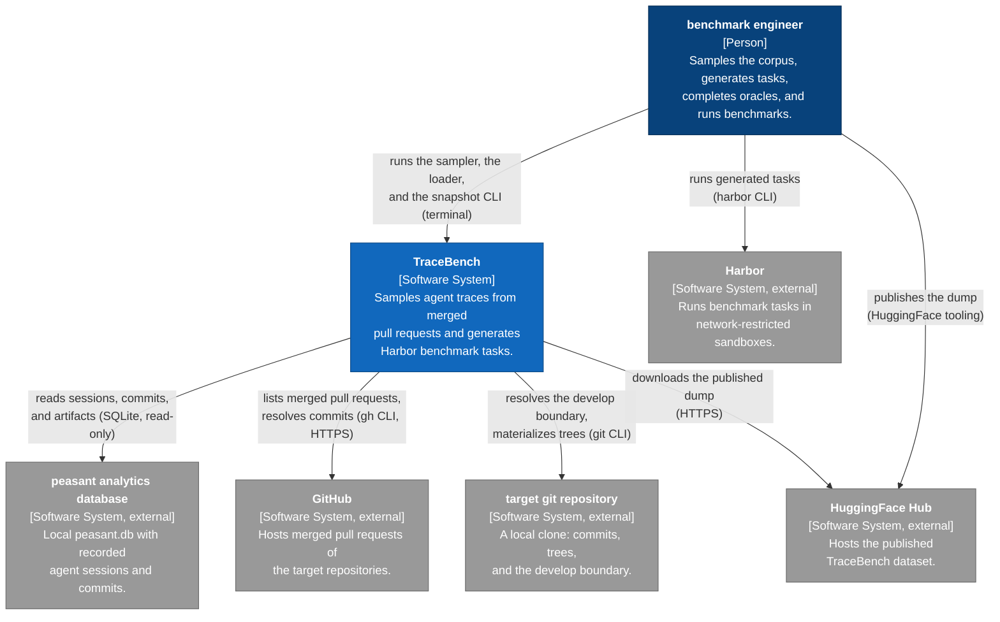

## Containers

TraceBench is a set of command-line tools plus files, not a service. `tracebench-sample` (Go)
builds the corpus; `tracebench-corpus` (Python) turns corpus entries into task payloads and
Harbor task skeletons; `snapshot` (Go, its own module) materializes repository trees and git
history at a cutoff. Everything runs on the developer's workstation.

Elements:

| Name | Type | Technology | Description |
|---|---|---|---|
| tracebench-sample | Container | Go | Corpus CLI: index, sample, run, dump, fetch. |
| tracebench-corpus | Container | Python, uv | Loader CLI: list, bundle, bundle-all, task, skeleton. |
| snapshot | Container | Go | Snapshot CLI: repo tree, trace, and history at a cutoff. |
| corpus tree | Container | JSON, JSONL | `corpus/index`, `corpus/dataset`, and `corpus/dump` artifacts. |
| task payload | Container | JSON, JSONL | Per-pull-request payload for one task. |
| snapshot output | Container | JSON, git tree | `history.json`, the materialized `repo/` tree, and `traces/`. |
| Harbor task | Container | TOML, shell, Dockerfile | Task directory: `task.toml`, `instruction.md`, `environment/`, `solution/`, `tests/`. |

Relationships:

| Source | Target | Intent | Technology |
|---|---|---|---|
| benchmark engineer | tracebench-sample | runs corpus commands | terminal |
| benchmark engineer | tracebench-corpus | runs loader commands | terminal |
| benchmark engineer | snapshot | runs snapshot commands | terminal |
| benchmark engineer | Harbor task | completes the oracle and the verifier | editor |
| benchmark engineer | Harbor | runs tasks | harbor CLI |
| tracebench-sample | peasant analytics database | reads sessions, commits, and artifacts; exports captures | SQLite read-only, peasant CLI |
| tracebench-sample | GitHub | lists merged pull requests, resolves commits | gh CLI, HTTPS |
| tracebench-sample | corpus tree | writes index, dataset, and dump artifacts | files |
| tracebench-sample | HuggingFace Hub | fetches the published dump | HTTPS |
| tracebench-corpus | corpus tree | reads the dump, writes per-PR bundles | files |
| tracebench-corpus | HuggingFace Hub | downloads the dump when no local copy exists | huggingface_hub |
| tracebench-corpus | task payload | writes and rebuilds payloads | files |
| tracebench-corpus | Harbor task | writes task skeletons | files |
| snapshot | target git repository | reads commits, trees, and archives | git CLI |
| snapshot | peasant analytics database | resolves a PR start through the peasant CLI | exec |
| snapshot | snapshot output | writes history.json, repo/, and traces/ | files |
| Harbor | Harbor task | reads task.toml, environment/, and tests/ | harbor CLI |

```mermaid
flowchart TB
  dev["<b>benchmark engineer</b><br/>[Person]<br/>Samples the corpus, generates tasks,<br/>completes oracles, and runs benchmarks."]:::person

  subgraph tb["TraceBench [Software System]"]
    sample["<b>tracebench-sample</b><br/>[Container: Go]<br/>Corpus CLI: index, sample,<br/>run, dump, fetch."]:::container
    loader["<b>tracebench-corpus</b><br/>[Container: Python, uv]<br/>Loader CLI: list, bundle,<br/>bundle-all, task, skeleton."]:::container
    snap["<b>snapshot</b><br/>[Container: Go]<br/>Repo tree, trace, and history<br/>at a cutoff."]:::container
    corpustree[("<b>corpus tree</b><br/>[Container: JSON, JSONL]<br/>corpus/index, corpus/dataset,<br/>corpus/dump.")]:::container
    payload[("<b>task payload</b><br/>[Container: JSON, JSONL]<br/>pr.json, prior-traces/, repo/,<br/>tests/, repo-request.json, task.json.")]:::container
    snapout[("<b>snapshot output</b><br/>[Container: JSON, git tree]<br/>history.json, repo/, traces/.")]:::container
    taskdir[("<b>Harbor task</b><br/>[Container: TOML, shell, Dockerfile]<br/>task.toml, instruction.md,<br/>environment/, solution/, tests/.")]:::container
  end

  db["<b>peasant analytics database</b><br/>[Software System, external]"]:::external
  gh["<b>GitHub</b><br/>[Software System, external]"]:::external
  git["<b>target git repository</b><br/>[Software System, external]"]:::external
  hf["<b>HuggingFace Hub</b><br/>[Software System, external]"]:::external
  harbor["<b>Harbor</b><br/>[Software System, external]"]:::external

  dev -->|"runs corpus commands<br/>(terminal)"| sample
  dev -->|"runs loader commands<br/>(terminal)"| loader
  dev -->|"runs snapshot commands<br/>(terminal)"| snap
  dev -->|"completes oracles<br/>(editor)"| taskdir
  dev -->|"runs tasks<br/>(harbor CLI)"| harbor

  sample -->|"reads sessions, commits, artifacts;<br/>exports captures (SQLite, peasant CLI)"| db
  sample -->|"lists pull requests, resolves commits<br/>(gh CLI, HTTPS)"| gh
  sample -->|"writes index, dataset, dump<br/>(files)"| corpustree
  sample -->|"fetches the dump<br/>(HTTPS)"| hf
  loader -->|"reads the dump, writes bundles<br/>(files)"| corpustree
  loader -->|"downloads the dump<br/>(huggingface_hub)"| hf
  loader -->|"writes payloads<br/>(files)"| payload
  loader -->|"writes skeletons<br/>(files)"| taskdir
  snap -->|"reads commits and trees<br/>(git CLI)"| git
  snap -->|"resolves a PR start<br/>(exec)"| db
  snap -->|"writes history and trees<br/>(files)"| snapout
  harbor -->|"reads the task<br/>(harbor CLI)"| taskdir

  style tb fill:none,stroke:#444,stroke-dasharray:6 4

  classDef person fill:#08427b,stroke:#052e56,color:#fff
  classDef system fill:#1168bd,stroke:#0b4884,color:#fff
  classDef container fill:#438dd5,stroke:#2e6295,color:#fff
  classDef component fill:#85bbf0,stroke:#5d82a8,color:#000
  classDef external fill:#999999,stroke:#6b6b6b,color:#fff
```

### Corpus tree

| Path | Contents |
|---|---|
| `corpus/index/` | `merged_prs.json`, `sessions.json`, `traces.json`, `commits.json`, `session_relations.json`, `summary.json`. |
| `corpus/dataset/` | `manifest.json` and `<split>/<owner--name>/pr-<number>/` with `pr.json` and `transcripts/`. |
| `corpus/dump/` | `manifest.json`, `metadata.jsonl`, `transcripts/<session_id>.jsonl`, `pull_requests.jsonl`, `traces.jsonl`. |
| `corpus/dump-village-pull/` | The same dump built from pulled transcripts, plus `village_pulls.jsonl`. |

### Task payload

| Path | Contents |
|---|---|
| `pr.json` | The pull request, enriched from `--index` (`merge_commit`, `head_oid`, `base_ref`). |
| `prior-traces/` | `traces.jsonl`, `metadata.jsonl`, `transcripts/`, and `manifest.json` for the prior context. |
| `repo/` | Integration point: the working tree at the pre-PR state; empty until materialized. |
| `tests/` | Integration point: every test file at the merged state; empty until materialized. |
| `repo-request.json` | The contract for the repository tooling: `tree_commit`, `trace_cutoff`, test patterns, glob dialect, merge-commit policy. |
| `task.json` | Payload summary: cutoff, target configuration, counts, exclusions. |

### Harbor task

| Path | Contents |
|---|---|
| `task.toml` | Identity, metadata, timeouts, network policy, `[environment].docker_image` and `workdir`. |
| `instruction.md` | Agent instructions, scaffolded from the pull request. |
| `environment/` | `repo/` and `prior-traces/`, uploaded into the container workdir at environment start. |
| `tests/` | The merged-state golden suite (verifier only) and `test.sh`. |
| `solution/` | The oracle. A generated skeleton starts with a non-zero placeholder. |

## Components

### Corpus build path

`tracebench-sample` builds the index, samples the corpus, and writes the dump. The index links
each recorded session to merged pull requests through head-ref keys, same-issue open windows, and
commit associations; a session may link to several pull requests. The collector closes over
parent, child, and fork lineage so a bundle carries the session forest around its attributed
work. The dump writes `schema.UnifiedMetadata` records and `schema.TranscriptContent` envelopes,
redacted through the redact engine, and exports sessions whose raw source is not a plain file
through the peasant CLI.

| Component | Package | Description |
|---|---|---|
| cli | `cmd/tracebench-sample` | Command tree: index, sample, run, dump, fetch. |
| prindex | `internal/prindex` | Merged PRs from gh, session keys, attribution, commit mapping, lineage relations, index persistence. |
| peasantstore | `internal/peasantstore` | Read-only SQLite reads: sessions, commits, lineage edges, artifacts, pulled transcripts, transcript exports. |
| sampler | `internal/sampler` | Time- and size-stratified selection; group-aware split assignment. |
| collector | `internal/collector` | Materializes bundles: transcript copies or exports, per-PR records, dataset manifest. |
| dump writer | `internal/dump` | Writes metadata, transcript envelopes, indexes, and the dump manifest; redacts through the redact engine. |
| fetch | `internal/fetch` | Downloads the published dump and verifies each transcript's content hash. |

Relationships:

| Source | Target | Intent | Technology |
|---|---|---|---|
| benchmark engineer | cli | runs corpus commands | terminal |
| cli | prindex | builds the merged-PR index | Go call |
| cli | sampler | selects splits | Go call |
| cli | collector | materializes bundles | Go call |
| cli | dump writer | writes the dump | Go call |
| cli | fetch | downloads the published dump | Go call |
| prindex | GitHub | lists merged PRs, resolves commits | gh CLI, HTTPS |
| prindex | peasantstore | reads sessions and commits | Go call |
| peasantstore | peasant analytics database | reads rows, exports captures | SQL read-only, peasant CLI |
| collector | peasantstore | opens transcripts | Go call |
| dump writer | peasantstore | reads artifacts, exports captures | Go call, peasant CLI |
| dump writer | corpus tree | writes metadata, transcripts, indexes | files |
| fetch | HuggingFace Hub | downloads dump files | HTTPS |
| fetch | corpus tree | writes the fetched dump | files |

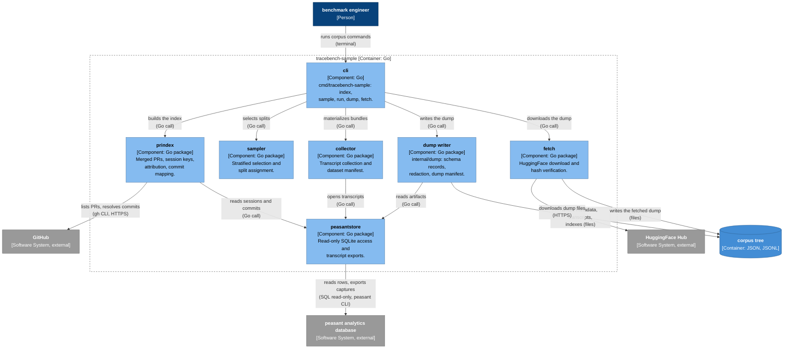

### Loader path

`tracebench-corpus` loads the dump and produces, per pull request, a task payload. The prior
context is every trace of the same codebase family merged before the pull request's develop
boundary; the pull request's own sessions are excluded, and prior sessions that ran past the
boundary are cut. `develop` keeps one commit per pull request (squash-rebase), so the boundary is
the parent of the pull request's squash commit; `--repo-dir` resolves it by commit ancestry, and
`merged_at` is the portable proxy otherwise. `skeleton` turns a payload into a Harbor task
directory that references a shared base image and uploads task data at environment start.

| Component | Module | Description |
|---|---|---|
| cli | `tracebench_corpus/cli.py` | Commands: list, bundle, bundle-all, task, skeleton. |
| corpus loader | `tracebench_corpus/corpus.py` | Loads a local or HuggingFace dump; per-PR bundles; transcript turns. |
| task builder | `tracebench_corpus/task.py` | Boundary and cutoff resolution, prior-trace selection, session cuts, repo-request, destination hygiene. |
| skeleton builder | `tracebench_corpus/skeleton.py` | task.toml, instruction.md, environment upload, golden-suite verifier script. |
| target configuration | `tracebench_corpus/target_config.py` | Spec validation and the harness/model/thinking record. |

Relationships:

| Source | Target | Intent | Technology |
|---|---|---|---|
| benchmark engineer | cli | runs loader commands | terminal |
| cli | corpus loader | loads the dump, materializes bundles | Python call |
| corpus loader | corpus tree | reads dump files | files |
| corpus loader | HuggingFace Hub | downloads the dump | huggingface_hub |
| cli | task builder | builds a payload | Python call |
| task builder | corpus loader | reads traces, metadata, transcripts | Python call |
| task builder | target git repository | resolves the boundary and ancestry | git CLI |
| task builder | target configuration | validates and records the target | Python call |
| task builder | task payload | writes and rebuilds the payload | files |
| cli | skeleton builder | generates the task directory | Python call |
| skeleton builder | task payload | reads the payload and repo-request | files |
| skeleton builder | Harbor task | writes task.toml, environment, tests | files |

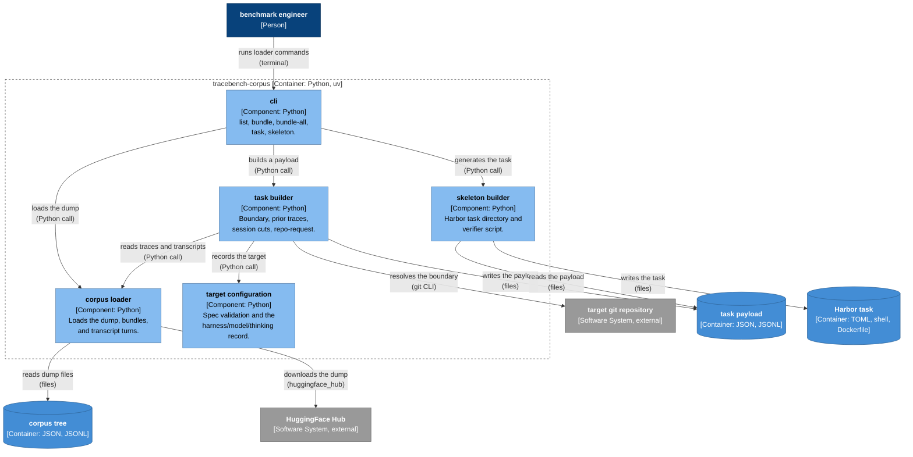

### Snapshot path

`snapshot` is a separate Go module. It resolves a cutoff (an absolute date, inclusive, or a pull
request start, exclusive), truncates the git history and the tree at the newest satisfying
commit, collects trace files, and writes a deterministic snapshot: `history.json` with a
`manifest_sha256`, and with `--materialize`, the exact `git archive` tree and trace copies. The
materialized tree is the repository tooling that fills a payload's `repo/` integration point;
the wiring to `repo-request.json` is not landed yet, so a payload's `repo/` and `tests/` stay
empty until it is.

| Component | File | Description |
|---|---|---|
| cli | `snapshot/cmd/snapshot` | Flags: repo, cutoff type, peasant binary, output, materialize. |
| cutoff resolver | `snapshot/cutoff.go` | Date (inclusive) or PR start (exclusive). |
| peasant client | `snapshot/peasant.go` | Resolves a PR number to its start time through the peasant binary contract. |
| repo snapshotter | `snapshot/repo.go` | History list, tree list, and `git archive` materialization. |
| trace collector | `snapshot/trace.go` | Trace files by event time; stub or directory provider. |
| assembler | `snapshot/api.go` | Snapshot assembly, canonical manifest hash, history.json, materialize. |

Relationships:

| Source | Target | Intent | Technology |
|---|---|---|---|
| benchmark engineer | cli | runs snapshot commands | terminal |
| cli | assembler | builds and writes the snapshot | Go call |
| assembler | cutoff resolver | resolves the cutoff | Go call |
| assembler | repo snapshotter | lists history and trees | Go call |
| assembler | trace collector | lists trace files | Go call |
| cutoff resolver | peasant client | resolves a PR start | Go call |
| peasant client | peasant analytics database | runs the peasant CLI | exec |
| repo snapshotter | target git repository | runs log, ls-tree, archive | git CLI |
| assembler | snapshot output | writes history.json and trees | files |

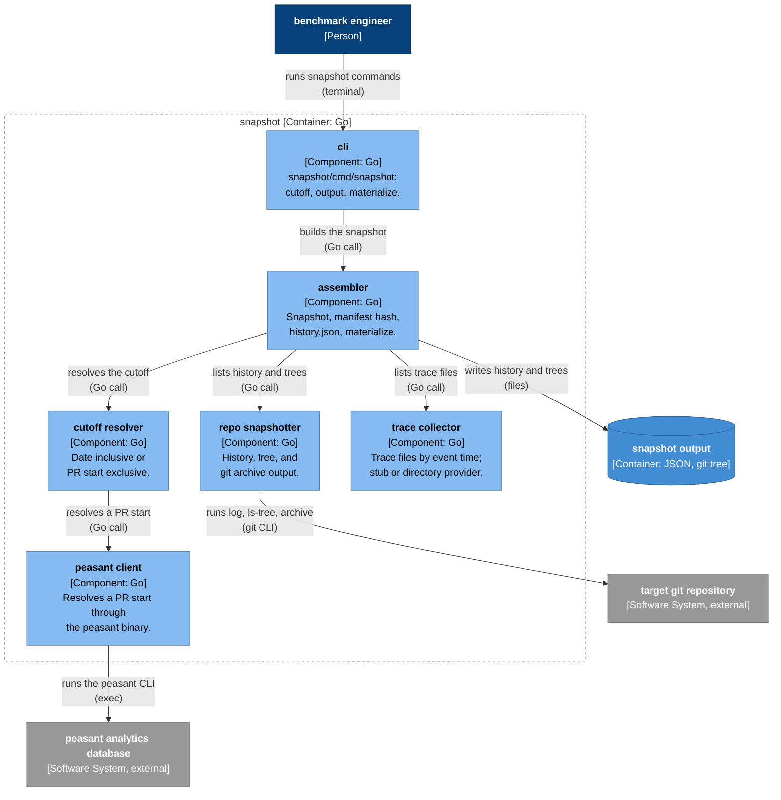

## Deployment

Everything builds and runs on the developer workstation. The sampler, the loader, and the
snapshot CLI run as local commands. The peasant database lives at
`$XDG_DATA_HOME/peasant/peasant.db` and is opened read-only. Harbor builds the task image
`FROM` the shared base image `tracebench/peasant-base` (task Dockerfiles pin a snapshot tag),
starts the sandbox, uploads `environment/` into the workdir, and runs three phases:

- **environment**: public network, for the image build and task-data upload;
- **agent**: no network, the agent works on `workdir/repo`;
- **verifier**: no network, `tests/` is copied to `/tests`, `test.sh` runs, and the reward is
  written to `/logs/verifier/reward.txt`.

The base image warms the Go module and build caches; each task image checks out its older base
commit, truncates every history vector, clears the build cache, re-downloads the pinned module
versions, and proves the final build offline. The model API is reached from the host only; the
sandbox itself stays offline.

```mermaid
flowchart TB
  subgraph ws["developer workstation [Deployment Node: Linux, macOS, or WSL]"]
    subgraph processes["TraceBench [Deployment Node: OS processes]"]
      sample["<b>tracebench-sample</b><br/>[Container: Go]"]:::container
      loader["<b>tracebench-corpus</b><br/>[Container: Python, uv]"]:::container
      snap["<b>snapshot</b><br/>[Container: Go]"]:::container
    end
    subgraph files["data dirs [Deployment Node: filesystem]"]
      corpustree[("<b>corpus tree</b><br/>[Container: JSON, JSONL]<br/>corpus/index, dataset, dump")]:::container
      payload[("<b>task payloads</b><br/>[Container: JSON, JSONL]<br/>pr.json, prior-traces, repo-request")]:::container
      taskdir[("<b>Harbor tasks</b><br/>[Container: TOML, shell]<br/>tasks/&lt;name&gt;")]:::container
      db[("<b>peasant database</b><br/>[Container: SQLite]<br/>peasant.db, read-only")]:::container
      clone[("<b>target git clone</b><br/>[Container: git working tree]<br/>commits and trees")]:::container
    end
    subgraph sandbox["task sandbox [Deployment Node: Docker or Podman]"]
      taskimg[("<b>task image</b><br/>[Container: FROM tracebench/peasant-base]")]:::container
      run["<b>task run</b><br/>[Container: environment,<br/>agent, verifier phases]"]:::container
    end
    harbor["<b>harbor CLI</b><br/>[Container: Python]"]:::external
  end

  gh["<b>GitHub</b><br/>[Software System, external]"]:::external
  hf["<b>HuggingFace Hub</b><br/>[Software System, external]"]:::external
  api["<b>model API</b><br/>[Software System, external]"]:::external

  sample -->|"reads sessions<br/>(SQLite, read-only)"| db
  sample -->|"lists pull requests<br/>(gh CLI, HTTPS)"| gh
  sample -->|"writes the corpus<br/>(files)"| corpustree
  sample -->|"fetches the dump<br/>(HTTPS)"| hf
  loader -->|"reads the dump<br/>(files)"| corpustree
  loader -->|"resolves boundaries<br/>(git CLI)"| clone
  loader -->|"writes payloads<br/>(files)"| payload
  loader -->|"writes skeletons<br/>(files)"| taskdir
  snap -->|"reads history<br/>(git CLI)"| clone
  harbor -->|"builds the task image<br/>(container runtime)"| taskimg
  harbor -->|"starts the task run<br/>(container runtime)"| run
  run -->|"reads uploaded task data<br/>(files)"| taskdir
  harbor -->|"model API calls use the<br/>host network (HTTPS)"| api

  style ws fill:none,stroke:#444,stroke-dasharray:6 4
  style processes fill:none,stroke:#444,stroke-dasharray:4 4
  style files fill:none,stroke:#444,stroke-dasharray:4 4
  style sandbox fill:none,stroke:#444,stroke-dasharray:4 4

  classDef person fill:#08427b,stroke:#052e56,color:#fff
  classDef system fill:#1168bd,stroke:#0b4884,color:#fff
  classDef container fill:#438dd5,stroke:#2e6295,color:#fff
  classDef component fill:#85bbf0,stroke:#5d82a8,color:#000
  classDef external fill:#999999,stroke:#6b6b6b,color:#fff
```

## Dynamic views

### Build the corpus

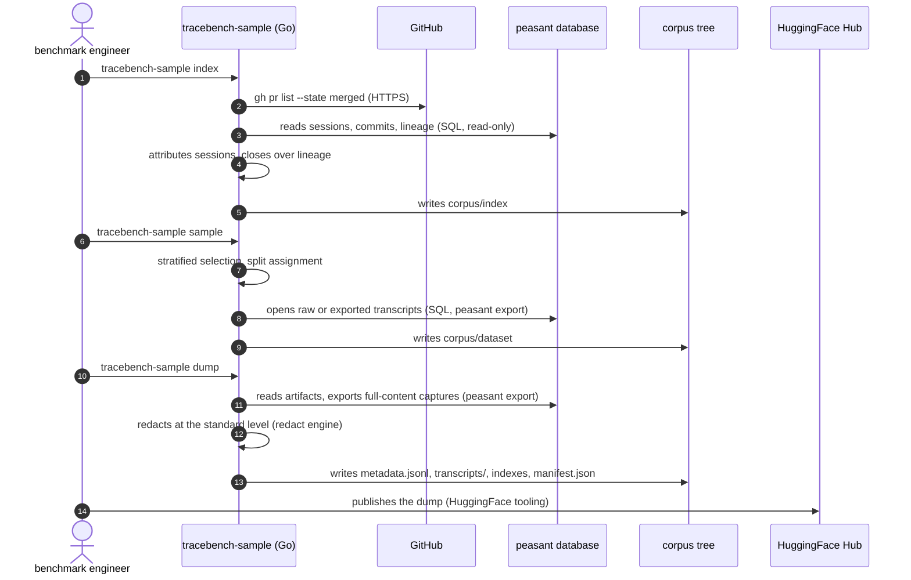

### Generate a task from the corpus

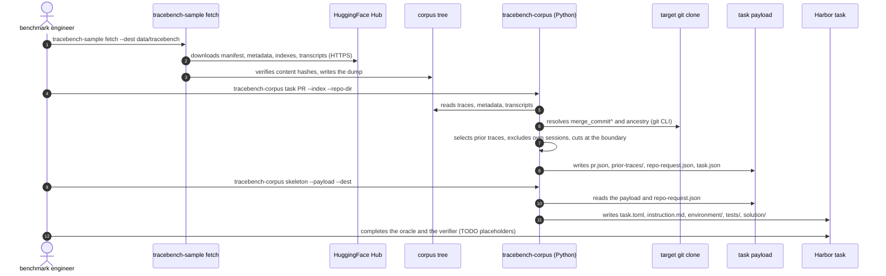

### Run a task

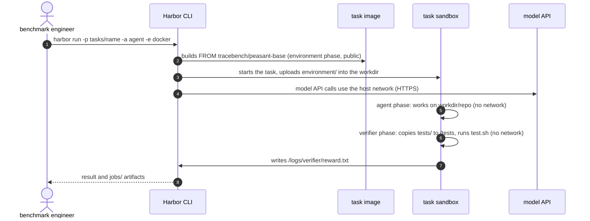

### Snapshot a repository at a cutoff

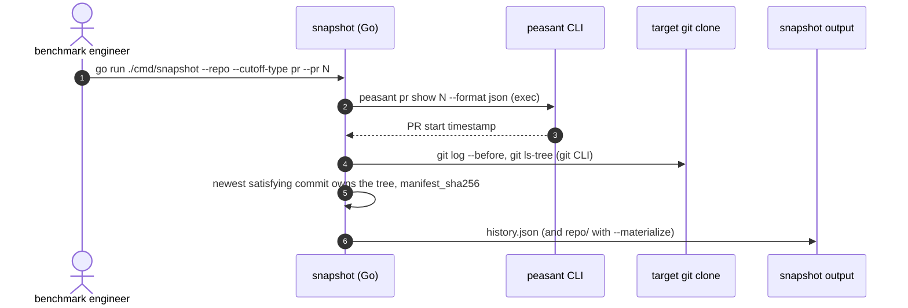

## Call sequences

Solid arrows are calls. Dashed arrows are returns. An arrow from a participant to itself is a
step inside that participant.

### Index and sample

Entry: `cmd/tracebench-sample/main.go` (`runIndex`, `sampleAndCollect`). Index: `internal/prindex`.
Sampling: `internal/sampler`. Collection: `internal/collector`.

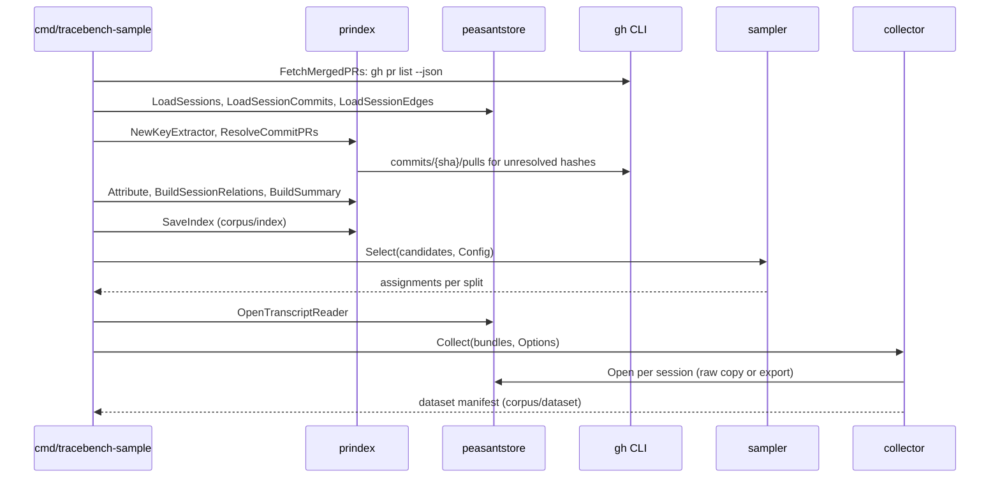

### Task payload and skeleton

Entry: `loaders/tracebench_corpus/cli.py` (`_task`, `_skeleton`). Payload:
`loaders/tracebench_corpus/task.py`. Skeleton: `loaders/tracebench_corpus/skeleton.py`.

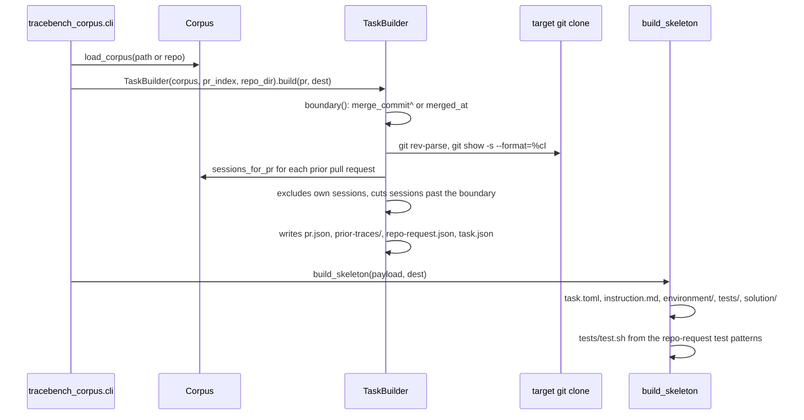

### Snapshot

Entry: `snapshot/cmd/snapshot/main.go`. Assembly: `snapshot/api.go`. Cutoff:
`snapshot/cutoff.go`. Git: `snapshot/repo.go`. Traces: `snapshot/trace.go`.

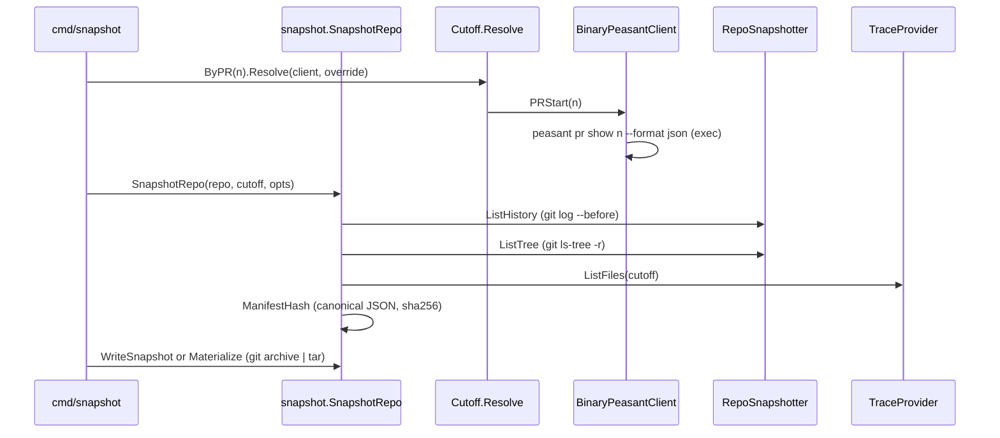

## Package map

| Path | Role | Main callers |
|---|---|---|
| `cmd/tracebench-sample` | Command tree: index, sample, run, dump, fetch. | user |
| `internal/corpus` | Shared data model: pull requests, sessions, trace links, session artifacts. | all Go packages |
| `internal/prindex` | gh pull-request listing, session keys, attribution, commit mapping, lineage relations, index persistence. | `index`, `sample` |
| `internal/peasantstore` | Read-only SQLite access: sessions, commits, lineage edges, artifacts, pulled transcripts, transcript exports. | prindex, collector, dump |
| `internal/sampler` | Time- and size-stratified selection and group-aware split assignment. | `sample` |
| `internal/collector` | Bundle materialization: transcript copies or exports, per-PR records, dataset manifest. | `sample` |
| `internal/dump` | Dump writer: schema records, redaction, indexes, dump manifest. | `dump` |
| `internal/fetch` | HuggingFace download and content-hash verification. | `fetch` |
| `loaders/tracebench_corpus` | Python loader: corpus, bundles, task payloads, skeletons, target configurations. | task authors, Harbor |
| `snapshot` | Go module: cutoff resolution, repo tree and history materialization, trace collection. | snapshot users |
| `tasks/_base` | Shared base-image Dockerfile with warmed Go caches. | task image builds |
| `tasks/<name>` | Harbor task definitions: instruction, task.toml, environment, solution, tests. | `harbor run` |
| `scripts/verify-issue-*.sh` | Acceptance checks for the containerized codebase and the snapshot API. | developers |
